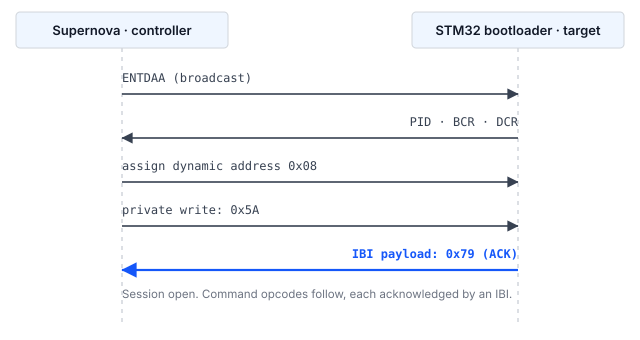

## 1 Introduction

The system bootloader programmed into the ROM of every STM32 microcontroller provides a
means of programming internal flash memory over a serial interface, without a debug probe
and without any user code present on the device. The interfaces offered by the bootloader
vary by device and are listed per part number in AN2606.

On STM32H5 series devices the list includes I3C. This is useful in two situations. In the
first, an I3C bus is already routed on the board to reach sensors or other peripherals, and
the same two wires can carry a firmware update, removing the need for a dedicated
programming header. In the second, several targets share one bus and are addressed
individually through dynamic address assignment, without strapping resistors or fixture
reconfiguration between boards.

### 1.1 Scope

This document describes:

- the structure of the I3C system bootloader protocol, including the mechanism used to
  report command status
- the connections required between a Binho Supernova and an STM32 target
- the procedure for identifying, erasing, programming and verifying a device
- a reference host utility, supplied with this document, that implements the procedure

Programming through the Open Bootloader application, in-application programming, and secure
firmware update mechanisms are outside the scope of this document.

### 1.2 Applicable devices

The bootloader interfaces available on a device are device-specific. An I3C peripheral does
not imply an I3C bootloader. Table 1 lists the STM32 families whose bootloader is documented
to offer I3C, with the device identifier returned by the Get ID command.

Table: STM32 families whose system bootloader offers an I3C interface

| Family | Example parts | Device ID | Basis |
|---|---|---|---|
| STM32H5 | STM32H503 | `0x474` | Verified on hardware for this document |
| STM32H5 | STM32H523, STM32H533 | `0x478` | RM0481 |
| STM32H5 | STM32H562, STM32H563, STM32H573 | `0x484` | STMicroelectronics Open Bootloader configuration |
| STM32H7R, STM32H7S | STM32H7S78 | `0x485` | STMicroelectronics Open Bootloader configuration |
| STM32U3 | STM32U385 | `0x454` | STMicroelectronics Open Bootloader configuration |

STM32N6 series devices include an I3C peripheral, but the STMicroelectronics Open Bootloader
distribution does not provide an I3C interface for that family.

> **Important:** Only the STM32H503 was exercised on hardware during preparation of this
document. The remaining entries in Table 1 are recognized by the reference utility but have
not been tested. AN2606 is the authoritative source for the bootloader interfaces available
on a given part number and must be consulted before this method is designed into a product.

### 1.3 Related documents

Table: Related documents

| Document | Title |
|---|---|
| AN2606 | STM32 microcontroller system memory boot mode |
| AN5927 | I3C protocol used in the STM32 bootloader |
| AN5879 | Introduction to I3C for STM32 MCUs |
| RM0481 | STM32H523/H533, STM32H562/H563/H573 line reference manual |
| RM0492 | STM32H503 line Arm-based 32-bit MCUs reference manual |
| MIPI I3C | MIPI Alliance Specification for I3C Basic |

## 2 System overview

### 2.1 Roles on the bus

The Supernova operates as the I3C controller. The STM32 bootloader operates as an I3C
target. The controller starts every data transfer and drives the clock. The one exception is
the in-band interrupt, which the target raises to request the controller's attention; the
bootloader uses it to report status, as described in Section 2.2.

The target takes part in dynamic address assignment before it holds an address, arbitrating
with its provisioned identifier. Until an address has been assigned it does not respond to
addressed traffic, and it does not accept bootloader commands until a synchronization byte
has been received and acknowledged.

### 2.2 Status reporting through in-band interrupts

The I3C bootloader differs from the I2C and USART bootloaders in one respect that determines
the structure of any host implementation.

The I2C and USART bootloaders return an acknowledgement byte that the host reads back over
the same interface. The I3C bootloader exposes no such readable status. Instead the target
raises an **in-band interrupt (IBI) carrying a single payload byte**, and that byte is the
acknowledgement. The bootloader configures its I3C peripheral for IBI with one additional
data byte during initialization, and every acknowledgement it issues for the remainder of the
session is delivered this way.

Table 3 lists the payload values observed on an STM32H503.

Table: Status values carried in the acknowledgement IBI

| Value | Meaning |
|---|---|
| `0x79` | ACK. The step was accepted. |
| `0x1F` | NACK. The step was rejected. |

> **Note:** The bootloader defines two further values that the I3C interface does not use:
`0x76` for busy, and `0xEC`, which the STMicroelectronics Open Bootloader sources use as an
internal marker for a failed opcode integrity check rather than transmitting it. Neither was
observed on the I3C interface. Every rejection encountered
during the preparation of this document, including a malformed opcode, was reported as
`0x1F`. Section 5.8 gives the cases that were exercised.

Consequently every step of every command follows the same pattern: the controller writes a
number of bytes, then waits for an IBI and reads its payload. A host I3C stack that cannot
deliver IBI payloads to the application, or that surfaces IBIs only as asynchronous events
that cannot be waited on, is not sufficient to implement this protocol.

> **Note:** This requirement should be confirmed against the intended host adapter and
driver before development begins.

## 3 Hardware setup

### 3.1 Required equipment

Table: Required equipment

| Item | Description |
|---|---|
| Binho Supernova | USB host adapter, operating as the I3C controller |
| STM32 target | A device from Table 1. A NUCLEO-H503RB was used for this document. |
| Host computer | Windows, macOS or Linux with Python 3.8 or later. Python 3.12 was used for the measurements in this document. |
| Serial terminal | Any terminal emulator, for the verification procedure of Section 7. Not needed for programming itself. |

### 3.2 Connections

Table 5 lists the connections between the Supernova and the target. The three bus signals
are required. The two general-purpose pins are optional and are used to place the target in
bootloader mode automatically; without them the operator performs that step by hand.

The Supernova does not supply power to the target. It drives the I3C bus at the voltage
configured in software, but the target board must be powered independently. On a Nucleo
board the USB connection to the on-board ST-LINK does this, and that same connection carries
the virtual COM port used in Section 7.

Table: Connections between the Supernova and the target

| Supernova | Target | Required |
|---|---|---|
| I3C SCL | `PB6` | Yes |
| I3C SDA | `PB7` | Yes |
| GND | GND | Yes |
| GPIO 1 | `NRST` | No |
| GPIO 2 | `BOOT0` | No |

`PB6` and `PB7` are the pins AN2606 assigns to `I3C1_SCL` and `I3C1_SDA` in its STM32H503xx
bootloader configuration. The pins are fixed in ROM and differ per part, so they must be read
from AN2606 for the device in hand rather than inferred from the board silkscreen or from
which pins a board's I3C connector happens to route. The same part answers its I2C bootloader
on a different pair, `PB3` and `PB4`, which is the subject of AN0002.

### 3.3 Bus considerations

The I3C bus voltage must match the target I/O supply. The Supernova bus voltage is set by
the host software; 3300 mV was used for the measurements in this document, matching the
NUCLEO-H503RB I/O supply.

Bus pull-up requirements follow the MIPI I3C specification and depend on bus capacitance and
the open-drain data rate in use. Where the target board does not populate suitable pull-ups
on the I3C signals, they must be added.

> **Caution:** NRST must never be driven high. To reset the target, drive NRST low, then
release it by reconfiguring the pin as an input and allowing the pull-up on the target board
to restore the high level. Driving NRST high opposes the reset circuitry on the target board
and, on a Nucleo board, the on-board debugger as well.

## 4 Software setup

### 4.1 Installing the host package

The reference utility drives the I3C bus through the Binho Supernova Python package:

```
pip install binhosupernova
```

Version 4.2.0 was used for this document. No other package is required; Intel HEX parsing is
implemented within the utility.

The same utility also programs targets over I2C, from either a Supernova or a Binho Pulsar,
which needs `binhopulsar` instead. Only the I3C path is described here; AN0002 covers I2C.

### 4.2 Obtaining the reference utility

The utility `stm32_flash.py` is supplied in the assets archive that accompanies this
document. It is the same file supplied with AN0002, so one copy covers both buses:

```
https://cdn.binho.io/application-notes/AN0001/AN0001-assets.zip
```

The same files, together with the Markdown source of this document, are published at
`https://github.com/binhollc/application-notes`. Section 12 lists the archive contents.

The archive expands to an `assets` directory holding the utility, and a `firmware`
subdirectory holding the verification images of Section 7. Every command in this document is
shown as it would be run from inside that `assets` directory.

## 5 Bootloader protocol

### 5.1 Entering system bootloader mode

The device must be reset with BOOT0 held high in order to execute the system bootloader
rather than user flash. Where GPIO 1 and GPIO 2 are connected as described in Section 3.2,
the host performs this automatically:

1. Drive BOOT0 high.
2. Drive NRST low and hold it low for 50 ms.
3. Release NRST by reconfiguring the pin as an input.
4. Allow 250 ms for the bootloader to initialize before starting bus activity.

The hold and settle times above are the defaults used by the reference utility and are
adjustable with `--reset-hold` and `--boot-delay`. Returning the device to the application
reverses the level on BOOT0 and repeats the reset pulse.

> **Note:** On some devices the option bytes `nBOOT0` and `nSWBOOT0` determine whether the
BOOT0 pin is sampled at all. Where a device does not enter the bootloader despite BOOT0
being held high, the option byte configuration should be checked.

### 5.2 Bus initialization and dynamic address assignment

The controller issues a broadcast ENTDAA. The bootloader participates in dynamic address
assignment and is allocated a dynamic address. The target returns the standard eight-byte
payload comprising a 48-bit provisioned identifier, the bus characteristics register and the
device characteristics register.

Values observed on an STM32H503 are given in Table 6.

Table: Identification returned by an STM32H503 during dynamic address assignment

| Field | Value |
|---|---|
| Dynamic address | `0x08` (first free address on a single-target bus) |
| Provisioned ID | `02 08 13 81 B0 00` |
| BCR | `0x2E` |
| DCR | `0x01` |

The controller must then be configured to accept IBI requests from this target. Where the
controller rejects IBIs, all subsequent commands appear to time out.

### 5.3 Session synchronization

The controller performs a private write of the single byte `0x5A` to the target's dynamic
address. The bootloader recognizes this value as the start of a session and replies with an
IBI carrying `0x79`. The session is then open and the bootloader waits for command opcodes.



### 5.4 Command framing

Each command is sent as two bytes: the opcode followed by its bitwise complement. The target
verifies that the two bytes exclusive-OR to `0xFF`.

Commands that operate on memory take a four-byte address, most significant byte first,
followed by a single byte holding the exclusive-OR of those four bytes.

Data payloads are followed by a single byte holding the exclusive-OR of the payload.

Every one of these steps is acknowledged by an IBI, as described in Section 2.2. The
byte-level sequence for each individual command is given in `PROTOCOL.md` in the assets
archive.

### 5.5 Transfer size field

The Read Memory and Write Memory commands take a three-byte transfer header before each
block of data:

Table: Transfer header

| Byte | Content |
|---|---|
| 0 | Size field, most significant byte |
| 1 | Size field, least significant byte |
| 2 | Exclusive-OR of bytes 0 and 1 |

The size field is the block length shifted left by one bit, with the least significant bit
used as a continuation flag. When the continuation flag is set the target remains in its
transfer loop and advances the address itself, so the address is transmitted once for a
sequence of blocks rather than once per block.

The maximum block length is bounded by a buffer inside the bootloader whose size is not
published. In the STMicroelectronics reference implementation the read path accepts a block
of up to the buffer size and the write path accepts one byte less, so a length proven by
reading is not automatically valid for writing.

Larger blocks were exercised on an STM32H503 and returned correct data: reads compared byte
for byte at 512 and 1024 bytes, and writes at 512. Above those the adapter package refuses
the request before it reaches the target, so the bootloader's own ceiling was never reached
and is not established here. The asymmetry between the two paths is real in practice, though:
the read path accepted 1024 where the write path did not.

The utility uses 256-byte blocks, which sits inside every limit involved, and the measurements
of Section 9 were taken at that size.

> **Important:** Remaining within the transfer loop is required for reliable operation, not
merely faster. Issuing a separate command for each block intermittently loses the command
opcode, because the target is still returning through its command dispatcher when the next
write arrives. Section 9.3 gives measurements.

### 5.6 Supported commands

Table 8 lists the commands reported by the Get command on an STM32H503, bootloader protocol
version 1.0.

Table: Commands supported over I3C on the STM32H503

| Opcode | Command |
|---|---|
| `0x00` | Get |
| `0x01` | Get Version |
| `0x02` | Get ID |
| `0x11` | Read Memory |
| `0x21` | Go |
| `0x31` | Write Memory |
| `0x44` | Extended Erase |
| `0x50` | Special Command |
| `0x63` | Write Protect |
| `0x73` | Write Unprotect |

Readout Protect (`0x82`) and Readout Unprotect (`0x92`) are not offered over I3C. Readout
protection (RDP) cannot be set or cleared through this interface, and a production flow that
requires it must perform that step over another interface.

### 5.7 Erase

Extended Erase takes a two-byte count, most significant byte first, followed by its
exclusive-OR byte. Values in the range `0xFFF0` to `0xFFFF` are reserved for special erase
operations.

Table: Extended Erase special values

| Value | Operation |
|---|---|
| `0xFFFF` | Mass erase |
| `0xFFFE` | Bank 1 erase |
| `0xFFFD` | Bank 2 erase |

Any other value is a count of pages, followed by that number of two-byte page numbers, each
most significant byte first, and a single exclusive-OR byte covering them all. On this device
a flash page is 8 KB, and `--erase pages` erases only the pages an image covers rather than
the whole device.

> **Note:** The encoding of the count field is not the same on both buses of this part. The
I3C interface takes the number of pages; the I2C interface takes the number of pages minus
one. Both were established by writing a distinct pattern into two adjacent pages, erasing the
first alone, and confirming which pages came back erased. AN0002 covers the I2C case. Sending
the wrong encoding erases a page more or fewer than intended, so the field should be confirmed
against the interface in use.

### 5.8 Rejected commands

Three malformed or out-of-range cases were issued to an STM32H503 to establish how the
bootloader reports a rejection.

Table: Rejection behavior observed on an STM32H503

| Case sent | Response |
|---|---|
| Opcode whose complement does not match | IBI, payload `0x1F` |
| Well-formed but unsupported opcode (`0x82`) | IBI, payload `0x1F` |
| Read Memory at an invalid address (`0x00000000`) | IBI, payload `0x1F` |

A rejection does not end the session. After each of the three cases above, a Get Version
issued immediately afterwards was acknowledged and returned `0x10` normally, so the
bootloader had returned to waiting for a command opcode in every case. A host does not need
to reset the target to recover from a NACK.

> **Note:** A fourth case, a transfer header requesting more than the bootloader's buffer,
could not be produced. The adapter package refuses an oversized request before it reaches the
target, as described in Section 5.5, so how the bootloader would answer one is untested.

## 6 Programming procedure

### 6.1 Identifying the target

The `info` command resets the target into the bootloader, initializes the bus, performs
dynamic address assignment, opens a session and reports what responded:

```
python stm32_flash.py --bus i3c info

  Adapter: supernova  fw 4.4.0
  Bus: I3C
  Resetting target into bootloader (NRST=GPIO1, BOOT0=GPIO2)
  I3C: 3300 mV, push-pull PUSH_PULL_2_5_MHZ_25_DC, open-drain OPEN_DRAIN_1_MHZ
  Assigning dynamic addresses (ENTDAA)
  Target at 0x08  PID 02 08 13 81 B0 00  BCR 0x2E  DCR 0x01
  Bootloader session established

  Protocol version : 1.0
  Device ID        : 0x474  (STM32H503)
  Commands         : 10
      0x00  Get
      ...
      0x73  Write Unprotect
```

The ten supported commands are listed in full between those lines; they are the ones given
in Table 8. The adapter's serial number is printed on the first line and is omitted here.
`--bus i3c` is required because the utility drives three buses and a Supernova offers all
of them, so it cannot infer which one is wired.

This is the recommended first step on any new board, as it confirms wiring, bus
configuration and bootloader entry before any destructive operation is attempted.

### 6.2 Reading the existing contents

Flash contents should be archived before an erase. The following command reads the whole
128 KB flash of an STM32H503RB:

```
python stm32_flash.py --bus i3c read backup.bin --address 0x08000000 --length 0x20000
```

### 6.3 Programming an image

The `flash` command performs the complete sequence: mass erase, program, read back and
compare, then reset into the application. The verification images of Section 7 are used as
the example here so that the commands can be run exactly as printed.

A raw binary requires an explicit base address:

```
python stm32_flash.py --bus i3c flash firmware/an0001_image_a.bin --address 0x08000000
```

An Intel HEX file carries its own addresses, so the option is omitted. Running `make hex` in
the `firmware` directory produces one:

```
python stm32_flash.py --bus i3c flash firmware/build/an0001_image_a.hex
```

### 6.4 Verification

Verification is performed by default. The programmed range is read back over the same
interface and compared byte for byte with the source image. It is disabled with
`--no-verify` where programming time is critical and the image is verified by other means.

### 6.5 Returning the device to the application

Where GPIO 1 and GPIO 2 are connected, the utility drives BOOT0 low and pulses NRST after
programming, so the device starts the newly programmed application. Where those pins are not
connected, the Go command is issued instead, which causes the bootloader to jump to the
image without a reset. `--no-run` leaves the device in the bootloader.

## 7 Confirming the update on the target

The `flash` command reads the programmed range back and compares it byte for byte, which
proves that the contents of flash match the image supplied. It does not prove that the
device is executing the new firmware: a target left in the bootloader, or one whose reset
never released, would pass that check and still not be running the application.

Two small firmware images are supplied with this document to close that gap. They are
identical except for the letter they report and the rate at which they blink the user LED,
so the change is visible from outside the programming tool.

### 7.1 The verification images

Table: Verification images supplied with this document

| Image | File | Reports | LED |
|---|---|---|---|
| A | `firmware/an0001_image_a.bin` | `IMAGE A` | 1 Hz |
| B | `firmware/an0001_image_b.bin` | `IMAGE B` | 5 Hz |

The images are 868 and 864 bytes and are linked to run from `0x08000000`. Source, a linker script and
a makefile are supplied alongside them, so the images can be inspected and rebuilt rather
than taken on trust.

Both print at **115200 baud, 8 data bits, no parity, 1 stop bit** on USART3, which the
NUCLEO-H503RB routes to the ST-LINK virtual COM port. No additional wiring is needed; the
USB cable already connected to the ST-LINK carries the output.

> **Note:** The supplied binaries are built for the NUCLEO-H503RB. They drive PA4 as
USART3_TX and PA5 as the user LED, which is how that board is wired. On any other board the
serial output will not appear, because the pin and the routing to the virtual COM port
differ. The images are small and the source is supplied, so retarget it by changing the pin
and peripheral definitions at the top of `firmware/main.c` and rebuilding.

A banner is printed once at reset, followed by one heartbeat line every second:

```
========================================
  Binho  |  AN0001
  Programming STM32 microcontrollers
  over I3C with the Binho Supernova
========================================
  Running: IMAGE A
  Kernel clock: 32 MHz
  LED blink: 1 Hz
========================================
  IMAGE A  alive, 1 s
  IMAGE A  alive, 2 s
```

The heartbeat is there because a banner printed only at reset is missed if the terminal is
opened afterwards. With the heartbeat, the running image can be identified at any time.

> **Note:** The reported kernel clock is 32 MHz, not the 64 MHz of the HSI itself. On this
device the reset value of `HSIDIV` is 2. The images read that divider at run time and derive
the baud divisor from it rather than assuming a frequency, because assuming 64 MHz produces
a baud rate that is wrong by a factor of two and output that is merely garbled rather than
absent.

### 7.2 Procedure

1. Open a serial terminal on the ST-LINK virtual COM port at 115200 8N1.
2. Program Image A and let the utility start the application:

```
python stm32_flash.py --bus i3c flash firmware/an0001_image_a.bin --address 0x08000000
```

```
  ...
  Device ID        : 0x474  (STM32H503)
  Mass erasing
    done in 0.03 s
  Writing
    wrote 868 bytes in 0.06 s (13.5 KiB/s)
  Verifying
    all 868 bytes match (0.05 s)
  Resetting into application
  Success.
```

The output above is abridged; the bus and session lines of Section 6.1 appear first, and the
exact times vary a little between runs.

3. Confirm that the terminal reports `IMAGE A` and that the LED blinks at 1 Hz.
4. Program Image B:

```
python stm32_flash.py --bus i3c flash firmware/an0001_image_b.bin --address 0x08000000
```

5. Confirm that the terminal now reports `IMAGE B` and that the LED blinks at 5 Hz.

The transition from `IMAGE A` to `IMAGE B` is the end-to-end result: the image was erased,
programmed and verified over I3C, and the device is running what was programmed.

> **Important:** Programming these images erases the application already on the device.
Archive the existing contents first, as described in Section 6.2.

## 8 Reference utility

### 8.1 Commands

Table: Utility commands

| Command | Function |
|---|---|
| `list` | List connected Binho adapters |
| `info` | Identify the target and report bootloader capabilities |
| `flash <file>` | Erase, program, verify and run an image |
| `read <file>` | Read memory to a file |
| `erase` | Mass erase |
| `reset` | Reset into the bootloader or the application |

### 8.2 Options

The options in Table 13 describe the adapter, the bus and bootloader entry, and apply to
every command. They may be given either before or after the command name.

Table: Session options

| Option | Function |
|---|---|
| `--adapter <name>` | Force `supernova` or `pulsar`; detected automatically when only one is attached |
| `--bus <name>` | Force `i3c` or `i2c`; detected automatically when only one is possible |
| `--serial <sn>` | Select a specific adapter |
| `--voltage <mV>` | I3C bus voltage, default 3300 |
| `--push-pull <name>` | Push-pull rate constant, default `PUSH_PULL_2_5_MHZ_25_DC` |
| `--open-drain <name>` | Open-drain rate constant, default `OPEN_DRAIN_1_MHZ` |
| `--target-address <addr>` | Select one target on a multi-target bus |
| `--manual` | Prompt for manual bootloader entry instead of driving GPIO |
| `--nrst-pin <n>`, `--boot0-pin <n>` | Select the GPIO pins used for reset control |
| `--reset-hold <s>` | Time NRST is held low, default 0.05 |
| `--boot-delay <s>` | Settle time after reset, default 0.25 |
| `-v` | Log every transfer |
| `-q` | Suppress progress output |

The rate options take the constant names used by the adapter package rather than a frequency.
The push-pull constants name a frequency and a duty cycle, such as `PUSH_PULL_5_MHZ_40_DC`;
the open-drain constants are `OPEN_DRAIN_100_KHZ`, `OPEN_DRAIN_400_KHZ` and
`OPEN_DRAIN_1_MHZ`.

The utility also accepts groups of I2C and SPI options, which have no effect on an I3C bus.
They are listed in AN0002 and AN0003.

The options in Table 14 apply to the command named against them.

Table: Per-command options

| Command | Option | Function |
|---|---|---|
| `flash` | `--address <addr>` | Base address for raw binary images |
| `flash` | `--erase <mode>` | `mass`, `pages` or `none` |
| `flash` | `--page-size <n>` | Flash page size for `--erase pages`, default 8192 |
| `flash` | `--no-verify` | Skip read-back verification |
| `flash` | `--no-run` | Leave the device in the bootloader |
| `flash`, `read` | `--chunk-size <n>` | Bytes per transfer. Default 256, the largest verified on this device |
| `flash`, `erase` | `--erase-timeout <s>` | Seconds to wait for an erase, default 30 |
| `read` | `--address <addr>` | Start address |
| `read` | `--length <n>` | Number of bytes to read. Required. |
| `read`, `erase`, `info` | `--run` | Reset into the application afterwards |
| `reset` | `--bootloader` | Reset into the bootloader instead of the application |

## 9 Measured results

### 9.1 Test configuration

Table: Test configuration

| Item | Value |
|---|---|
| Target | NUCLEO-H503RB, STM32H503RB, device ID `0x474` |
| Adapter | Binho Supernova, hardware revision B, firmware 4.4.0 |
| Host package | `binhosupernova` 4.2.0, Python 3.12 |
| Utility | `stm32_flash.py`, as supplied in the assets archive |
| Bus | 3300 mV, 2.5 MHz push-pull, 1 MHz open-drain |
| Transfer size | 256 bytes |

### 9.2 Timing

Measured for a 122,912-byte image.

Table: Measured timing for a 122,912-byte image

| Operation | Time | Throughput |
|---|---|---|
| Mass erase | 0.03 s | not applicable |
| Program | 5.92 s | 20.3 KiB/s |
| Verify | 5.16 s | 23.3 KiB/s |
| Read 128 KB | 5.72 s | 22.4 KiB/s |

Erase, program and verify together account for 11.1 s of that, which is what a complete
update of an image this size costs.

Each figure is one representative run. Times vary between runs by a few percent: across
repeats, programming fell between 5.62 s and 5.92 s and verification between 5.03 s and
5.44 s, while three consecutive 128 KB reads took 5.70 s each and returned byte-identical
data. The table should be read as the order of magnitude to expect, not as a specification.

Measured at 2.5 MHz push-pull with 256-byte transfer blocks. The I3C peripheral on this part
is single data rate only, with no high data rate mode, and its SDR ceiling is 12.5 MHz, so a
higher push-pull rate is available where throughput matters. Larger transfer blocks are also
available where the target buffer permits.

### 9.3 Transfer loop behavior

The measurements in Table 17 compare a separate Read Memory command for each block against
remaining within the transfer loop, over a 32 KB read, three runs per configuration.

Table: Read Memory, separate command per block against the transfer loop

| Method | Delay between commands | Successful runs | Average time |
|---|---|---|---|
| One command per block | 0 ms | 1 of 3 | 2.17 s |
| One command per block | 1 ms | 2 of 3 | 2.38 s |
| One command per block | 2 ms | 0 of 3 | not applicable |
| One command per block | 5 ms | 3 of 3 | 2.91 s |
| Transfer loop | 0 ms | 3 of 3 | 1.39 s |
| Transfer loop | 1 ms | 3 of 3 | 1.57 s |

Failures occurred at a different offset on each run and always while awaiting the
acknowledgement for a newly issued command opcode. Inserting a delay changes the failure
rate without removing the hazard. Six consecutive 128 KB reads performed within the transfer
loop returned byte-identical data.

## 10 Troubleshooting

Table: Troubleshooting

| Symptom | Probable cause and action |
|---|---|
| No target responds to ENTDAA | The device did not enter bootloader mode. Confirm BOOT0 was high at reset and check the `nBOOT0` and `nSWBOOT0` option bytes. Check ground, bus pull-ups and bus voltage. |
| No status IBI received | The controller is rejecting IBIs, or a write was lost and the target is still waiting for it. Confirm IBI acceptance is enabled for the target address, then reset the target and reopen the session. |
| Acknowledgement `0x1F` after an address | The address lies outside a valid memory area, or the address integrity byte is wrong. |
| Acknowledgement `0x1F` on a transfer header | The requested block exceeds the target buffer. Reduce the transfer size with `--chunk-size`. |
| Acknowledgement `0x1F` on an opcode | The opcode and its complement do not exclusive-OR to `0xFF`, or the command is not supported on this device. Compare against Table 8. |
| Acknowledgement `0x1F` on Write Memory | Flash is write-protected, or readout protection is active. |
| Intermittent loss of commands | A separate command is being issued per block. Use the transfer loop as described in Section 5.5. |

## 11 Acronyms

Table: Acronyms

| Term | Meaning |
|---|---|
| BCR | Bus characteristics register |
| DCR | Device characteristics register |
| ENTDAA | Enter dynamic address assignment, an I3C common command code |
| IBI | In-band interrupt |
| PID | Provisioned identifier |
| RDP | Readout protection |
| SDR | Single data rate |

## 12 Note about the source code in the document

Example code shown in this document and supplied in the accompanying archive is provided for
evaluation and reference. It is released under the MIT license, the text of which is included
in the archive.

The archive `AN0001-assets.zip` is published at
`https://cdn.binho.io/application-notes/AN0001/AN0001-assets.zip` and contains:

Table: Contents of the assets archive

| File | Description |
|---|---|
| `AN0001.md` | Markdown source of this document |
| `assets/stm32_flash.py` | Reference utility, shared with AN0002 |
| `assets/test_hex_parser.py` | Tests for the Intel HEX parser in the utility |
| `assets/PROTOCOL.md` | Wire-level protocol reference |
| `assets/firmware/` | Source, makefile and prebuilt binaries for the two verification images |
| `assets/LICENSE` | MIT license covering the example code |

## 13 Revision history

Table: Revision history

| Revision | Date | Description |
|---|---|---|
| 1.0 | 29 August 2026 | Initial release. |
