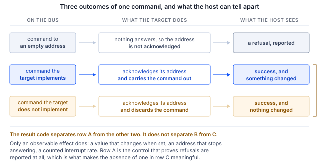

## 1 Introduction

A device datasheet lists the MIPI I3C common command codes the part supports, usually as a
table with a column of Y and N entries. That table is the natural starting point when
bringing up a new target, and on its own it is not sufficient to write a host against.

Two properties of I3C make it insufficient. The first is that a target which has been
assigned a dynamic address acknowledges that address, and a target may acknowledge a command
it does not implement and then discard it. Nothing distinguishes that outcome, at the host,
from a command that was carried out. The second is that a CCC support table describes the
command, not the effect: a part may recognize a command, answer it with a defined value, and
still not do the thing the command names.

Both properties are visible in the three parts described here. All three answer at least ten
commands their own datasheets mark as unsupported. One lists a command to enter a
high-data-rate mode as supported and then explains in a footnote that high-data-rate
operation is not supported at all. Two answer a query about their high-data-rate capability
with a defined value meaning none.

None of this is a defect in the parts or in the documentation. It is a consequence of what
I3C permits, and it means that a target's usable feature set has to be established by
observing effects rather than by reading status. This document describes how to do that from
a host, and supplies a utility that does it.

### 1.1 Scope

This document describes:

- enumeration and identification of an I3C target, and how to read a capability directly
  from the target's bus characteristics register
- the register access framing used by three Bosch Sensortec parts, which differs between
  them
- how to establish, by measurement, which common command codes a target implements
- configuring a sensor to raise its data-ready interrupt as an I3C in-band interrupt, with no
  interrupt pin connected
- the highest bus rates at which the parts operate without error, and the method used to
  establish them
- a reference host utility, supplied with this document, that performs all of the above

Sensor calibration, the algorithms in the parts' feature engines, and the vendor driver
software for these devices are outside the scope of this document. The utility supplied here
exercises the I3C target in a sensor; it is not a sensor driver.

### 1.2 Applicable devices

Table 1 lists the parts exercised for this document, and the parts the I3C Target Board
accepts that were not exercised. A profile written from a datasheet alone is exactly the
assumption this document argues against, so the untested rows are marked as such and no
support claims are made for them.

Table: Bosch Sensortec parts and the basis for each row

| Part | Function | Board | Basis |
|---|---|---|---|
| BMI323 | 6-axis IMU | Shuttle 3.0 | Verified on hardware for this document |
| BMP581 | Barometric pressure | Shuttle 3.0 | Verified on hardware for this document |
| BMP585 | Barometric pressure, media resistant | Shuttle 3.0 | Verified on hardware for this document |
| BMM350 | Magnetometer | Shuttle 3.0 | Accepted by the I3C Target Board. Not exercised |
| BMA530, BMA580 | Accelerometer | Shuttle 3.0 | Accepted by the I3C Target Board. Not exercised |

> **Note:** the method in Section 5.5 does not depend on the part. It applies to any I3C
> target, including the rows above that were not exercised and parts from other vendors.

### 1.3 Related documents

Table: Related documents

| Document | Title |
|---|---|
| BST-BMI323-DS000 | BMI323 datasheet |
| BST-BMP581-DS004 | BMP581 datasheet |
| BST-BMP585-DS003 | BMP585 datasheet |
| MIPI I3C v1.0 | Improved Inter Integrated Circuit, 23 December 2016 |
| MIPI I3C v1.1 | Improved Inter Integrated Circuit, version 1.1 |
| BIN103 | Binho I3C Target Board product documentation |

## 2 System overview

The host is a Binho Supernova USB host adapter acting as the I3C controller. The sensor is
carried on a Bosch Shuttle 3.0 evaluation board, which plugs into the Binho I3C Target Board.
The target board carries the bus between the Supernova's I3C connector and the shuttle
socket, and breaks out every target pin on 2.54 mm headers, with dedicated headers on SCL and
SDA for a logic analyzer.

The signal path is two wires and a supply. No interrupt pin, reset line or strapping resistor
is connected for any procedure in this document.

The I3C Target Board provides one Shuttle 3.0 socket and one STMicroelectronics DIL24 socket.
The three parts covered here all use the Shuttle 3.0 socket, so they are covered one at a
time, and the procedures below assume a single target on the bus. The bus is daisy-chainable
and a reader may extend it; that configuration is not exercised in this document.

One property of the bus shapes everything that follows, and is stated here because the rest
of the document is organized around it.

> **Important:** a target that has been assigned a dynamic address acknowledges that address.
> A target may acknowledge a common command code it does not implement, discard it, and
> return nothing to distinguish that from having carried it out. A successful transfer is
> therefore evidence that the target was addressed, and is not evidence that the target
> supports the command. Section 5.5 describes the consequence.

## 3 Hardware setup

### 3.1 Required equipment

Table: Required equipment

| Item | Note |
|---|---|
| Binho Supernova | Firmware 4.4.0 or later |
| Binho I3C Target Board | BIN103 |
| Bosch Shuttle 3.0 board | One of BMI323, BMP581 or BMP585 |
| USB-C cable | Host to Supernova |

### 3.2 Connections

Table: Connections

| From | To | Required |
|---|---|---|
| Supernova I3C connector | I3C Target Board I3C input | Yes |
| I3C Target Board Shuttle 3.0 socket | Bosch shuttle board | Yes |
| I3C Target Board power jumper | Supernova-supplied rail | Yes, unless an external supply is used |
| I3C Target Board SCL, SDA headers | Logic analyzer | No |

The shuttle board is keyed to its socket. No sensor pin is wired individually for any
procedure in this document.

### 3.3 Bus considerations

All measurements in this document were made at 3.3 V. The Supernova supplies the bus rail
through the target board when the power jumper selects it.

> **Caution:** confirm the shuttle board's supply rating before applying a rail. A Shuttle
> 3.0 board carries its own regulators, and the sensor's interface supply is not necessarily
> the rail applied to the board.

The controller's two clock rates are configured separately and are not independent. The
open-drain rate governs the broadcast phase of a transfer and the push-pull rate governs the
data phase, and the adapter rejects some combinations as an invalid frequency pair. Section
8.2 gives the rates the parts sustained and the constraint observed between the two.

The starting values used throughout this document are 3.3 V, a push-pull rate of 5 MHz at 50%
duty cycle, and an open-drain rate of 1 MHz. These are the utility's defaults.

## 4 Software setup

The utility requires Python 3.10 or later and the vendor SDK:

```
pip install binhosupernova
```

The versions used for the measurements in this document are given in Section 8.1. Extract the
assets archive and run the utility from the extracted directory:

```
python i3c_mems.py scan
```

A single command confirms the whole path from host to sensor:

```
1 target(s) on the bus at 3300 mV, PUSH_PULL_5_MHZ_50_DC, OPEN_DRAIN_1_MHZ

  dynamic address 0x08
    PID  07 70 10 51 10 00   device id 0x1051
         enumeration cached 07 70 10 51 00 00, which is the pre-settling value
    BCR  0x06   DCR 0x62
    HDR  SDR only   IBI capable
    profile  bmp585
```

## 5 I3C on these devices

### 5.1 Enumeration

Bus initialization issues RSTDAA, which clears any dynamic address already assigned, followed
by ENTDAA, in which each target on the bus arbitrates using its 48-bit provisional identifier
and is assigned a dynamic address. With one target present the assigned address is `0x08`.

ENTDAA also captures each target's provisional identifier, bus characteristics register and
device characteristics register into the controller's target table, which is why `scan` can
report them without issuing any further command.

Assigning addresses at run time also removes a constraint that applies to these parts on a
static-address bus. The BMP581 and BMP585 share the same static address pair, `0x46` and
`0x47`, selected by a pin, so two of them cannot be distinguished by address alone. Under
ENTDAA each is assigned a distinct dynamic address during enumeration and the conflict does
not arise.

> **Note:** the address conflict above is taken from the BMP581 and BMP585 datasheets and was
> not exercised for this document. The I3C Target Board has one Shuttle 3.0 socket, so the two
> parts were never on the bus at the same time. ENTDAA itself was exercised on every part
> individually, which is what Section 6.1 documents.

> **Note:** the identifier captured during ENTDAA is captured before the target has settled.
> On the BMP581 and BMP585, bit 12 of the provisional identifier reflects the level on the
> SDO pin, and it reads 0 in the cached copy and 1 when read back over the bus. Measured over
> eight consecutive enumerations, GETPID returned bit 12 as 0 on the first read every time and
> as 1 from the third read onward every time. The device identifier field is unaffected. The
> datasheets prescribe the remedy directly: a dummy read should be the first access to the
> device. The supplied utility discards two reads after enumeration for this reason, and
> `scan` reports both values where they differ.

### 5.2 Identity

Three registers identify a target, and all three are read with a single CCC each. Table 5
gives the values measured for the three parts.

Table: Identity values measured for the three parts

| Part | PID | BCR | DCR | Chip ID register | Chip ID |
|---|---|---|---|---|---|
| BMI323 | `07 70 10 43 00 00` | `0x06` | `0xEF` | `0x00` | `0x43` |
| BMP581 | `07 70 10 50 10 00` | `0x06` | `0x62` | `0x01` | `0x50` |
| BMP585 | `07 70 10 51 10 00` | `0x06` | `0x62` | `0x01` | `0x51` |

Every value matches the corresponding datasheet. The device identifier field, bits 31 to 16
of the provisional identifier, embeds the chip identifier in each case: `0x1043`, `0x1050`
and `0x1051`.

The BMP581 and BMP585 both report a DCR of `0x62`. The MIPI device characteristics register
registry assigns that value to a pressure sensor, so a controller can classify a target it
has no prior knowledge of.

> **Important:** the BMI323 chip identifier register is 16 bits wide and its upper byte is a
> reserved field that reads `0x11` on the parts measured, so the register reads `0x1143` while
> the datasheet gives a reset value of `0x0043`. A host comparing the whole word against the
> datasheet value concludes the part is wrong. Compare the low byte.

### 5.3 Reading a capability from the target

Bit 5 of the bus characteristics register is the MIPI advanced capabilities bit. The BMI323
datasheet states its meaning for that part without ambiguity: bit 5 is set to `0b0`, that is,
the device supports solely SDR.

All three parts report a BCR of `0x06`, in which bit 5 is clear. That single bit is the
reliable answer to whether a target offers a high-data-rate mode, and it is available from any
target on any bus in one command.

The alternatives are both unreliable, and Section 5.5 explains why:

- the CCC support table in the BMI323 datasheet marks ENTHDR0 as supported, and a footnote to
  the same table states that ENTHDR0 is recognized but the device does not support HDR
  operations
- the BMP581 and BMP585 support the CCC that reports HDR capability, and answer it with
  `0x00`, meaning no HDR modes
- an attempted HDR-DDR transfer returns a successful result on all three parts, and the bus
  remains usable afterwards, so the attempt distinguishes nothing

Table 6 decodes the BCR value common to all three parts.

Table: BCR 0x06 decoded

| Bits | Field | Value |
|---|---|---|
| 7:6 | Device role | I3C target |
| 5 | Advanced capabilities | Not supported, so SDR only |
| 4 | Virtual target support | Not supported |
| 3 | Offline capable | Always responds to bus commands |
| 2 | IBI mandatory payload | An accepted IBI is followed by a mandatory byte |
| 1 | IBI capable | Yes |
| 0 | Max data speed limit | No limit declared |

### 5.4 Register access

The three parts do not share a register access model, and the differences are not a vendor
convention that can be assumed once and reused. Table 7 gives what was measured.

Table: Register access measured per part

| Part | Register address | Data width | Dummy bytes before a read payload |
|---|---|---|---|
| BMI323 | 8 bits | 16 bits | 2 |
| BMP581 | 8 bits | 8 bits | 0 |
| BMP585 | 8 bits | 8 bits | 0 |

The BMI323 datasheet states the dummy byte count for each interface, giving two for I3C. The
BMP581 and BMP585 datasheets do not state a count for I3C, and none was observed.

Where the count is not documented, it can be established by reading a run of registers whose
reset values are known and finding the offset at which they line up. Two adjacent anchors are
enough to remove ambiguity. On the BMP585, CHIP_ID at `0x01` reads `0x51` and REV_ID at `0x02`
reads `0x32`:

```
dummy=0: raw 51 32          ->  CHIP_ID 0x51 REV_ID 0x32   <== both anchors match
dummy=1: raw 51 32 22       ->  CHIP_ID 0x32 REV_ID 0x22
dummy=2: raw 51 32 22 00    ->  CHIP_ID 0x22 REV_ID 0x00
```

A single anchor would have admitted more than one offset.

The broadcast address may be omitted from a transfer. Reads issued with and without the
leading `0x7E` header returned the same value on all three parts, which matches the BMP581 and
BMP585 datasheets: the host may skip the 7E header and start with the dynamic address section,
and this applies to all I3C transactions.

### 5.5 What "supported" means on this bus

The BMI323 datasheet marks ten common command codes as not supported: SETMWL, SETMRL, GETMWL,
GETMRL, GETMXDS, GETHDRCAP, ENTAS1, ENTAS2, ENTAS3 and SETGRPA. Every one of them returns a
successful result when sent to the part.

That is not the adapter concealing an error. The same commands sent to an address with no
target on it are refused, and the refusal is reported, as Table 8 shows.

Table: The same commands at the target and at an unoccupied address

| Command | At the target, `0x08` | At an unoccupied address, `0x0B` |
|---|---|---|
| GETPID | `SUCCESS`, returns the identifier | `I3C_NACK_ADDRESS` |
| GETBCR | `SUCCESS`, returns `0x06` | `I3C_NACK_ADDRESS` |
| SETMWL | `SUCCESS` | `I3C_NACK_ADDRESS` |
| ENTAS1 | `SUCCESS` | `I3C_NACK_ADDRESS` |
| Private read | `SUCCESS`, returns data | `I3C_NACK_ADDRESS` |

The absence of a refusal is therefore a real observation about the target, not a gap in the
controller's reporting. The target acknowledged its address and discarded the command.



It follows that support cannot be established from a result code, and has to be established
from an observable effect. Three forms of evidence are used in this document:

- **set and read back.** Send SETMWL with a value, then GETMWL. If the value does not change,
  the part does not implement the pair. This gives a definite negative.
- **an effect with a negative control.** Send SETNEWDA to move the target's dynamic address,
  then confirm the target answers at the new address and no longer answers at the old one. The
  second half is what makes it evidence.
- **a counted rate.** Enable an interrupt and count arrivals over a known window, then compare
  against the rate the sensor was configured to produce.

Where no observable effect can be constructed, the honest verdict is that support is
undetermined. That is not the same as unsupported, and this document does not report it as
such. The activity state commands are the clearest case: entering an activity state is
intended to change the target's power consumption, and no current measurement was available
on this bench, so those rows read undetermined and say why.

> **Note:** a value returned by a command the part does not implement carries no information.
> GETMWL returns `[0, 0]` on the BMI323, `[80, 80]` on the BMP581 and `[50, 50]` on the
> BMP585, and none of the three implements it. The evidence is that the value does not change
> when set, not what the value is.

### 5.6 Support matrix

Table 9 is produced by the `features` command of the supplied utility, which runs the
behavioral tests described above and reports one of three verdicts per row. It is reproduced
here from the runs recorded in Section 8.

Table: Measured common command code support

| Command | BMI323 | BMP581 | BMP585 | Evidence |
|---|---|---|---|---|
| ENTDAA | Supported | Supported | Supported | Target enumerated with the expected identifier |
| RSTDAA | Supported | Supported | Supported | Table cleared, old address then refuses |
| SETNEWDA | Supported | Supported | Supported | Address moved, old address refuses |
| GETPID, GETBCR, GETDCR | Supported | Supported | Supported | Returned the datasheet values |
| ENEC, DISEC | Supported | Supported | Supported | Interrupts start and stop, repeatably |
| SETXTIME, GETXTIME | Supported | Supported | Supported | A reported byte changed after the command |
| SETMWL, SETMRL | Not implemented | Not implemented | Not implemented | Value unchanged after being set |
| GETMWL, GETMRL | Not implemented | Not implemented | Not implemented | As above |
| SETGRPA, RSTGRPA | Not implemented | Not implemented | Not implemented | Target does not answer at the group address |
| HDR modes | Not supported | Not supported | Not supported | BCR bit 5 clear |
| GETHDRCAP | Not implemented | Answers `0x00` | Answers `0x00` | No HDR modes reported |
| Hot-join | Not observed | Not observed | Not observed | No hot-join request at any point |
| GETSTATUS | Undetermined | Undetermined | Undetermined | Answers, not independently checked |
| GETMXDS | Undetermined | Undetermined | Undetermined | Answers, no observable effect |
| ENTAS0 to ENTAS3 | Undetermined | Undetermined | Undetermined | Needs a current measurement |
| RSTACT | Undetermined | Undetermined | Undetermined | No observable effect from the host |

SETXTIME warrants a note, because it is the one row in Table 9 where repeating the test does
not repeat the result. Its sub-commands select modes and the mode bits latch, so a sub-command
the part is already in is correctly a no-op. On the BMI323, from a GETXTIME of
`03 00 0D 78`, sub-command `0x3F` moves the second byte to `0x01` and never moves it again,
while `0xDF` moves it to `0x03`. A host that sends one sub-command and sees no change cannot
conclude the command is unimplemented.

Enabling the timing control feature also changes the interrupt payload. On the BMI323 the
in-band interrupt payload grows from one byte to four and bit 7 of the mandatory byte, which
the specification reserves for its own use, is set. The three added bytes were nearly constant
across a run and are not a per-interrupt counter; what they encode was not established. The
mode persists across a host restart and a bus reset, and is cleared by a soft reset.

## 6 Procedure

### 6.1 Enumerate and identify

```
python i3c_mems.py identify --device bmp585
```

```
bmp585  (Bosch Sensortec, barometric pressure sensor)
  dynamic address 0x08

  PID 07 70 10 51 10 00
    MIPI member id (47:33)       0x03B8
    id type selector (32)        0
    device id (31:16)            0x1051
    instance id (15:12)          0b0001
    reserved (11:0)              0x000

  BCR 0x06
    device role                      I3C target
    advanced capabilities (bit 5)    no, so SDR only
    virtual target support           no
    offline capable                  yes
    IBI mandatory payload            yes
    IBI capable                      yes
    max data speed limit             no limit

  DCR 0x62   pressure sensor, per the MIPI DCR registry

  CHIP_ID register 0x01 reads 0x51, raw 51
    chip id field 0x51, expected 0x51: match

  register access: 1-byte data, 0 dummy byte(s) before a read payload
```

### 6.2 Configure a measurement

The BMI323 is configured with a single write to ACC_CONF at `0x20`. The value `0x3127` selects
an accelerometer range of ±8 g, an output data rate of 50 Hz, and an enabled power mode.

The BMP581 and BMP585 require an order rather than a single write. Configuration registers are
written while the part is in standby, and only then is the measurement mode entered:

1. write ODR_CONFIG at `0x37` with a power mode of standby
2. write OSR_CONFIG at `0x36` with `press_en` set, enabling pressure alongside temperature
3. write ODR_CONFIG again with the desired output data rate and a power mode of normal
4. read OSR_EFF at `0x38` and confirm `odr_is_valid`, which reports whether the rate and
   oversampling combination was accepted

> **Important:** on the BMP581 and BMP585 the interrupt block adopts a new INT_CONFIG value
> only at the next transition from standby into a measurement mode. The register accepts the
> write at any time and reads back the new value immediately, so a host that configures
> interrupts while the part is measuring sees every register correct and no interrupts. The
> effect measured on a BMP585 configured for 10 Hz was: interrupt configuration written in
> normal mode, no interrupts in 2 s; the same registers followed by a standby-to-normal
> transition, 21 interrupts; configured in standby and then entering normal, 20 interrupts.
> The datasheets' own guidance covers this: write configurations before switching into the
> measurement mode.

### 6.3 Read data

```
python i3c_mems.py stream --device bmp585 --seconds 2 --interval 0.5
```

Pressure is the 24-bit unsigned value divided by 64, in pascals. Temperature is the 24-bit
signed value divided by 65536, in degrees Celsius. The accelerometer axes are 16-bit signed
values divided by 4096 counts per g at the ±8 g range.

The reading is self-checking, which matters because a plausible-looking number from a
misconfigured part is the hardest error to notice. At rest the BMI323 reports an acceleration
magnitude of 1.006 g against a configured range whose scale factor is 4096 counts per g, so
the range field and the decode agree. Ambient pressure read 1003.52 hPa on the BMP585 and
1003.88 hPa on the BMP581 in the same room within the hour, agreeing to 0.36 hPa across two
parts on two boards.

### 6.4 Raise the sensor interrupt on the bus

The BMI323 routes an interrupt source to one of three destinations. Field `acc_drdy_int` in
INT_MAP2 at `0x3B` occupies bits 11 and 10 and takes `0b01` for the INT1 pin, `0b10` for INT2
and `0b11` for the I3C in-band interrupt. Writing `0x0C00` selects the last of these, and the
interrupt then arrives over the two wires already present, with no interrupt pin connected.

The order that works was established step by step, each step measured over a one-second
window, and is given in Table 10.

Table: What enables an in-band interrupt on the BMI323

| State | Interrupts in 1 s |
|---|---|
| Sensor disabled | 0 |
| DISEC sent, so the target's interrupt is disabled | 0 |
| Sensor running, no routing configured | 0 |
| `INT_MAP2` written, routing configured, still disabled | 0 |
| Controller configured to accept interrupts, still disabled | 0 |
| **ENEC sent with the ENINT bit** | **50** |

ENEC is what enables the interrupt. Neither the routing write nor the controller's own
configuration does so.

```
python i3c_mems.py ibi --device bmp585 --seconds 3 --show 3
```

```
bmp585 at 0x08: interrupt routed to the I3C IBI, pulsed
  IBI from 0x08  MDB 01  data ready=True, FIFO full=False, FIFO threshold=False, pressure out of range=False
  IBI from 0x08  MDB 01  data ready=True, FIFO full=False, FIFO threshold=False, pressure out of range=False
  IBI from 0x08  MDB 01  data ready=True, FIFO full=False, FIFO threshold=False, pressure out of range=False

  31 interrupts in 3.02 s = 10.28/s
  configured output data rate 10 Hz (+2.8%)
```

Each interrupt carries a mandatory byte identifying its cause, and the bit assignment is per
part. Table 11 gives the two layouts.

Table: Mandatory byte assignment, data-ready shown in bold

| Bit | BMI323 | BMP581 and BMP585 |
|---|---|---|
| 0 | FIFO watermark or FIFO full | **Data ready** |
| 1 | **Sample ready, accelerometer, gyroscope and temperature** | FIFO full |
| 2 | Feature engine interrupts | FIFO threshold |
| 3 | Reserved | Pressure out of range |
| 5:4 | Interrupt group identifier | Zero |
| 7 | Defined by the specification | Zero |

A data-ready interrupt therefore arrives as `0x02` from the BMI323 and `0x01` from the two
pressure sensors. There is no shared layout to rely on.

> **Important:** the BMP581 and BMP585 latch their interrupt by default. INT_CONFIG at `0x14`
> has a reset value of `0x35`, in which `int_mode` selects latched, and INT_STATUS at `0x27`
> is clear-on-read. The interrupt therefore asserts once and is not raised again until the
> host reads INT_STATUS. A host that does neither receives exactly one interrupt and then
> silence. Both remedies were measured at a configured 10 Hz: selecting pulsed mode gives
> 9.96 interrupts per second, and leaving the part latched while reading INT_STATUS after each
> interrupt gives 10.00. The BMI323 does not behave this way, so a host written against it
> and then pointed at a BMP58x will appear to find a broken interrupt.

`int_en` in the same register enables the physical interrupt pin and does not gate the in-band
interrupt. With the bit clear the measured rate was 10.00 interrupts per second, and with it
set, 9.95.

### 6.5 Disable the interrupt and reset

DISEC with the DISINT bit disables the target's interrupt. The BMI323 datasheet asks for DISEC
to be sent before RSTDAA, so that the target cannot raise an interrupt during the address
reset, and the supplied utility follows that order.

> **Note:** a single DISEC does not always stop the stream. Over repeated runs of the feature
> battery on a BMI323 at 50 Hz, roughly one attempt in six left the stream still arriving,
> while 45 consecutive attempts at 25, 50 and 100 Hz with no other traffic on the bus never
> failed. The cause was not established. A host should confirm that the stream has stopped
> rather than assume the command took effect; a second attempt was always sufficient.

Some target state survives both a host restart and a bus reset. The interrupt enable set by
ENEC is one example, and the timing control mode described in Section 5.6 is another. A soft
reset returns the part to its documented reset state: `0xDEAF` written to CMD at `0x7E` on the
BMI323, `0xB6` on the BMP581 and BMP585.

```
python i3c_mems.py reset --device bmi323
```

## 7 Reference

Table: Utility commands

| Command | Purpose |
|---|---|
| `scan` | Enumerate the bus and report what answered |
| `identify` | Decode a target's identity registers |
| `read`, `write` | Read or write a register, with a read-back after a write |
| `stream` | Print decoded samples by polling |
| `ibi` | Route the sensor interrupt onto the bus and count what arrives |
| `features` | Establish what the target implements, from observable effects |
| `rates` | Find the highest error-free bus rate |
| `reset` | Soft reset the part and re-enumerate |

Table: Session options, accepted before or after the command

| Option | Default |
|---|---|
| `--serial` | First adapter found |
| `--voltage` | 3300 |
| `--push-pull` | `PUSH_PULL_5_MHZ_50_DC` |
| `--open-drain` | `OPEN_DRAIN_1_MHZ` |
| `--drive` | `FAST_MODE` |
| `--device` | Required for all commands except `scan` |
| `--latched` | Off, so pulsed. BMP581 and BMP585 only |

Table: Registers used in this document

| Part | Register | Address | Use |
|---|---|---|---|
| BMI323 | CHIP_ID | `0x00` | Identity, low byte |
| BMI323 | ACC_DATA_X to Z | `0x03` to `0x05` | Acceleration |
| BMI323 | ACC_CONF | `0x20` | Range, rate, power mode |
| BMI323 | INT_MAP2 | `0x3B` | Interrupt routing, including to the IBI |
| BMI323 | CMD | `0x7E` | Soft reset, `0xDEAF` |
| BMP58x | CHIP_ID, REV_ID | `0x01`, `0x02` | Identity |
| BMP58x | CHIP_STATUS | `0x11` | Interface mode and I3C error flags |
| BMP58x | INT_CONFIG | `0x14` | Latched or pulsed, pin enable |
| BMP58x | INT_SOURCE | `0x15` | Interrupt source enable |
| BMP58x | TEMP, PRESS data | `0x1D` to `0x22` | Measurements |
| BMP58x | INT_STATUS | `0x27` | Interrupt status, clear-on-read |
| BMP58x | OSR_CONFIG, ODR_CONFIG | `0x36`, `0x37` | Oversampling, rate, power mode |
| BMP58x | OSR_EFF | `0x38` | `odr_is_valid` |
| BMP58x | CMD | `0x7E` | Soft reset, `0xB6` |

## 8 Measured results

### 8.1 Test configuration

Table: Test configuration

| Item | Value |
|---|---|
| Adapter | Binho Supernova, hardware revision B, firmware 4.4.0 |
| SDK | `binhosupernova`, Python 3.12, Windows 11 |
| Accessory | Binho I3C Target Board, BIN103 |
| Bus | 3.3 V, push-pull 5 MHz at 50% duty cycle, open drain 1 MHz, fast-mode drive strength |
| Enumeration | RSTDAA followed by ENTDAA |
| Targets | BMI323, BMP581, BMP585 on Bosch Shuttle 3.0 boards, one at a time |

### 8.2 Results

**Support.** The matrix in Table 9 was produced by the `features` command against each part.
The verdict counts were 10 supported, 7 not implemented and 8 undetermined for the BMI323, and
11 supported, 7 not implemented and 7 undetermined for the BMP585.

**Interrupt rate against configured rate.** The interrupt rate tracks the sensor's configured
output data rate.

Table: Interrupt rate against configured output data rate

| Part | Configured | Measured | Window |
|---|---|---|---|
| BMI323 | 50 Hz | 50.00 per second | 3.0 s |
| BMP581 | 10 Hz | 10.00 per second | 4.0 s |
| BMP585 | 10 Hz | 9.96 per second | 4.0 s |
| BMP585 | 30 Hz | 29.75 per second | 4.0 s |

> **Note:** the rate is comparable with the configured rate. Individual arrival times are not.
> Measured over 149 consecutive intervals at 50 Hz, the gaps between arrivals ranged from 0.00
> to 47.00 ms with a mean of 20.03 ms, and 6 of the 149 were under 1 ms, because the host
> transport delivers interrupts in batches. No jitter or latency figure is given in this
> document for that reason.

**Bus rate.** The method is that a rate passes only if a fixed loop of 120 reads of the chip
identifier register completes with no error and no incorrect value. The two rates are not
independent: the adapter rejects some combinations as an invalid frequency pair, so the
open-drain sweep was run at the highest push-pull rate that passed rather than at the default.

Both parts measured passed every rate the adapter offers, to a push-pull rate of 12.5 MHz at
50% duty cycle and an open-drain rate of 4.17 MHz.

> **Important:** this is a register read loop, not a throughput measurement. It establishes
> that the parts operate without error at the top of the adapter's range under the stated
> conditions. It does not characterise sustained transfer performance, and no such conclusion
> should be drawn from it.

## 9 Troubleshooting

Table: Troubleshooting

| Symptom | Probable cause and action |
|---|---|
| Nothing enumerates | Shuttle board not seated, or the target board's power jumper not selecting a rail. Confirm the rail before assuming a bus fault |
| Chip identifier appears wrong on a BMI323 | The register is 16 bits and its upper byte is reserved, reading `0x1143`. Compare the low byte against `0x43` |
| The identifier differs between two reads after enumeration | The first reads after ENTDAA are not settled. Discard two reads, as the datasheets prescribe. Only PID bit 12 is affected |
| Exactly one interrupt arrives, then none | A BMP581 or BMP585 in its default latched mode. Select pulsed mode, or read INT_STATUS after each interrupt |
| Interrupt registers are correct and no interrupt arrives | On a BMP58x, the interrupt block adopts INT_CONFIG only at the next standby-to-normal transition. Configure in standby, then enter the measurement mode |
| Interrupts arrive before they were enabled | The target's interrupt enable survives a host restart. Send DISEC, or soft reset, at the start of a session |
| Interrupts stop unexpectedly on a BMP58x | After an S0/S1 error the part may stop transmitting until the next start or stop condition. A dummy read to any device provides one |
| A command returns success and nothing changes | Expected. See Section 5.5. Establish support from an observable effect |
| A single DISEC does not stop the stream | Confirm the stream has stopped and repeat. See Section 6.5 |
| The adapter rejects a rate pair | The open-drain and push-pull rates are not independent. Raise the push-pull rate or lower the open-drain rate |
| A configuration write is lost | On a BMP58x, several registers accept writes only in standby. Write configuration before entering a measurement mode |

## 10 Acronyms

Table: Acronyms

| Term | Meaning |
|---|---|
| BCR | Bus characteristics register |
| CCC | Common command code |
| DAA | Dynamic address assignment |
| DCR | Device characteristics register |
| ENTDAA | Enter dynamic address assignment |
| HDR-DDR | High data rate, double data rate |
| IBI | In-band interrupt |
| IMU | Inertial measurement unit |
| MDB | Mandatory data byte |
| MEMS | Micro electro-mechanical system |
| ODR | Output data rate |
| OSR | Oversampling ratio |
| PID | Provisional identifier |
| RSTDAA | Reset dynamic address assignment |
| SDR | Single data rate |

## 11 Note about the source code in the document

Example code shown in this document and supplied in the accompanying archive is provided for
evaluation and reference. It is released under the MIT license, the text of which is included
in the archive.

Table: Contents of the assets archive

| File | Description |
|---|---|
| `AN0004.md` | Markdown source of this document |
| `assets/i3c_mems.py` | Reference utility, shared with AN0005 |
| `assets/LICENSE` | MIT license covering the example code |

## 12 Revision history

Table: Revision history

| Revision | Date | Description |
|---|---|---|
| 1.0 | 31 August 2026 | Initial release. |
