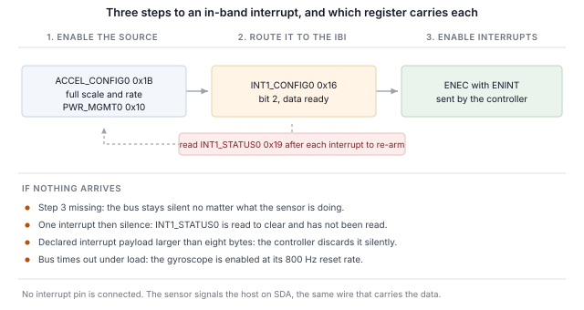

## 1 Introduction

The current generation of TDK InvenSense MEMS sensors offers a MIPI I3C interface alongside I2C
and SPI, on the same two pins. I3C keeps that two-wire footprint and adds a substantial feature
set on top of it.

Table: What I3C adds to a two-wire sensor interface

| Feature | What it gives a design |
|---|---|
| Dynamic address assignment | The controller hands out addresses at run time, so static address collisions stop being a board-design constraint and identical parts can share a bus |
| Identification from the bus | Every target reports a 48-bit provisional identifier, a device class and its bus capabilities, so a controller can enumerate a bus it was not built for |
| Common command codes | A standard command set, broadcast and direct, for enumeration, identification, configuration, interrupt control and reset, the same on every compliant target |
| In-band interrupts | The sensor interrupts the host on the data line, carrying a byte that says why, so no interrupt pin has to be routed or allocated |
| High data rate modes | Double data rate transfers move two bits per clock edge pair, doubling the signalling rate without raising the clock |
| Group addressing | One write reaches several targets at once, addressed as a group |
| Higher signalling rates | Push-pull clocking, to 12.5 MHz in single data rate mode, against the open-drain limits of I2C |
| Lower power | Push-pull signalling avoids the static pull-up current I2C spends continuously, and activity states let a controller tell targets what bus latency to expect so they can idle harder |
| Hot-join | A target powered up after the bus is running can ask to be enumerated |
| Timing control | The controller can have targets timestamp their interrupts against a shared reference |
| Standard reset and recovery | A defined target reset and defined error detection and recovery, rather than per-vendor sequences |
| I2C compatibility | Legacy I2C devices can share the bus |

A target implements the subset of that a sensor needs, and the subset differs between parts. The
ICM-45686 implements more of it than most: its bus characteristics register declares advanced
capabilities, which means high data rate transfers, and Section 8 puts that to the test.

This note works through the part from a Binho Supernova USB host adapter and the Binho mikroBUS
Adapter Board: enumerating it, identifying it from the bus, reading and writing registers,
streaming decoded measurements, getting interrupts over the data line with no interrupt pin
connected, transferring in HDR-DDR, and establishing which of the features above the target
actually implements.

Nothing here requires a microcontroller, firmware, or a driver port. Every step is a command from
a host PC.

### 1.1 Scope

By the end of this document a reader with the hardware in front of them will have enumerated a
sensor onto an I3C bus, identified it from its own registers, read and written registers,
streamed decoded measurements, received in-band interrupts at the sensor's configured output
data rate with no interrupt pin connected, performed an HDR-DDR read and checked it against the
single data rate read of the same register, and established what the target implements from
observable effects.

The part worked through is the ICM-45686. It is exercised on hardware and every output in this
document is a real capture.

### 1.2 Applicable devices

Table: Devices covered

| Device | Function | Board | Exercised on hardware |
|---|---|---|---|
| ICM-45686 | 6-axis IMU, accelerometer and gyroscope | 6DOF IMU 27 Click | Yes |

The method applies to any TDK InvenSense MEMS part with an I3C interface on a mikroBUS Click
board. Adding one to the supplied utility is a single table entry, described in Section 12.

### 1.3 Related documents

Table: Related documents

| Document | Subject |
|---|---|
| DS-000489, ICM-45686 datasheet | Register map and electrical characteristics |
| MIPI I3C Specification v1.1 | Common command codes, in-band interrupts, HDR modes, dynamic addressing |
| Binho mikroBUS Adapter Board product page | Sockets, jumpers, and supported Click boards |

## 2 Required equipment and software

### 2.1 Hardware

Table: Required equipment

| Item |
|---|
| Binho Supernova USB host adapter |
| Binho mikroBUS Adapter Board |
| 6DOF IMU 27 Click, or another mikroBUS MEMS Click board with an I3C interface |
| USB-C cable |

The Click board drops into the mikroBUS socket. Nothing else is connected for any procedure in
this document.

### 2.2 Connections

Table: Signals used

| Signal | Purpose |
|---|---|
| SCL | I3C clock, adapter to target |
| SDA | I3C data, bidirectional |
| 3.3 V | Target supply |
| GND | Return |

Two wires and a supply. **No interrupt pin, reset line or strapping resistor is connected for
anything in this note**, including the interrupt sections: on I3C the sensor signals the host
on SDA.

> **Note:** the mikroBUS Adapter Board does not source the bus rail the way the I3C Target Board
> does, so the utility's `power-cycle` command reports `I3C_PORTS_NOT_POWERED` here. It falls
> back to resetting the adapter, which is what recovers an I3C peripheral that has stopped
> responding while system commands still work.

### 2.3 Bus settings

Table: Bus settings used

| Setting | Value |
|---|---|
| Push-pull rate | 5 MHz at 50% duty cycle |
| Open-drain rate | 1 MHz |
| Drive strength | Fast mode |
| Bus voltage | 3.3 V |

These are starting values rather than limits. Section 10 establishes what the part sustains.

### 2.4 Software

```
pip install binhosupernova
```

Python 3.12 and the `binhosupernova` package are the only dependencies. Unpack the assets
archive that accompanies this note and confirm the setup with one command:

```
python i3c_mems.py scan
```

## 3 First contact: enumerate the bus

One command puts the sensor on the bus with an address the host assigned:

```
python i3c_mems.py scan
```

```
1 target(s) on the bus at 3300 mV, PUSH_PULL_5_MHZ_50_DC, OPEN_DRAIN_1_MHZ

  dynamic address 0x08
    PID  04 6A 00 00 00 11   device id 0x0000
    BCR  0x27   DCR 0x44
    HDR  claimed   IBI capable
    profile  icm45686
```

Two common command codes did that. **RSTDAA** clears any dynamic address already assigned, so
the bus starts from a known state. **ENTDAA** then runs dynamic address assignment: the
controller broadcasts, every target arbitrates using its 48-bit provisional identifier, and each
one is handed an address in turn. With one part present that address is `0x08`.

No address was configured anywhere. The part's own static address was not used and does not need
to be known.

Everything after the address in that output came from the target rather than from a lookup
table, which is the first thing that feels different from I2C. On I2C a host writes an address
it picked in advance and hopes something answers. Here the device introduces itself.

## 4 Identify the part from the bus

```
python i3c_mems.py identify --device icm45686
```

### 4.1 What the identity registers carry

Three registers do the introducing, and each is read with a single command rather than from the
register file.

```
  PID 04 6A 00 00 00 11
    MIPI member id (47:33)       0x0235
    id type selector (32)        0
    device id (31:16)            0x0000
    instance id (15:12)          0b0000
    reserved (11:0)              0x011
```

**The provisional identifier** carries a MIPI member ID, which identifies the manufacturer, and a
device identifier field.

> **Important:** this part leaves the device identifier field at `0x0000`. On many sensors that
> field embeds the value the part also reports in its identity register, which lets a controller
> name the part from enumeration alone. Here it does not, so a host that identifies parts by
> that field will not recognise this one and has to read the identity register instead. The
> supplied utility does exactly that: it matches on the field first and falls back to reading
> the register when the field names nothing.

**The device characteristics register** reports `0x44`, which the MIPI registry assigns to a
6-axis IMU. It identifies the class, not the individual part.

**The bus characteristics register** says what the part can do on the bus, and on this part it is
the most interesting of the three:

```
BCR 0x27
  device role                      I3C target
  advanced capabilities (bit 5)    yes
  virtual target support           no
  offline capable                  yes
  IBI mandatory payload            yes
  IBI capable                      yes
  max data speed limit             yes
```

**Bit 5 is set.** That is the target declaring high data rate capability, and it is what
Section 8 goes on to verify rather than take on trust. GETHDRCAP answers `0x01`, which is the
bit the MIPI specification assigns to HDR-DDR.

Bits 1 and 2 are also set, so the part raises in-band interrupts and sends a payload with them,
which Section 7 uses.

### 4.2 Confirming with the identity register

Table: Identity register

| Register | Value |
|---|---|
| `WHO_AM_I` at `0x72` | `0xE9` |

## 5 Read and write registers

Register access is a private transfer: send the register address, then read the bytes.

```
python i3c_mems.py read  --device icm45686 0x72
python i3c_mems.py write --device icm45686 0x1B 0x0A
```

Table: Register access framing

| Property | Value |
|---|---|
| Register address width | 8 bits |
| Data width | 8 bits |
| Dummy bytes before a read payload | 0 |
| Address auto-increment on a multi-byte read | Yes |

The address advances on a multi-byte read, so a six-byte read starting at the first
accelerometer register returns all three axes.

> **One register does not auto-increment, and a bring-up is likely to meet it first.** `FIFO_DATA` at
> `0x14` returns the FIFO, so a four-byte read there returns four bytes of FIFO rather than
> registers `0x14` through `0x17`. On a part whose FIFO is empty that reads as the same byte
> four times, which looks like an interface that cannot walk its own register file. It is
> correct behaviour for a FIFO. Every other register advances normally.

### 5.1 Byte order

The data registers are little endian: the low byte comes first.

That is worth checking rather than assuming, because the axes still decode to plausible-looking
numbers if the halves are swapped. The check costs nothing and is described in Section 6.

## 6 Stream sensor data

Two writes start the accelerometer.

Table: Starting the accelerometer

| Register | Value | Effect |
|---|---|---|
| `ACCEL_CONFIG0` at `0x1B` | `0x0A` | full scale field 0, which is ±32 g, and output data rate field 10, which is 50 Hz |
| `PWR_MGMT0` at `0x10` | `0x03` | accelerometer in low noise mode |

```
python i3c_mems.py stream --device icm45686 --seconds 5
```

```
  x     0.021 g   y    -0.028 g   z     1.005 g   magnitude     1.006 g
  x     0.020 g   y    -0.028 g   z     1.005 g   magnitude     1.005 g
  x     0.021 g   y    -0.028 g   z     1.006 g   magnitude     1.006 g
```

Six bytes from `0x00`, three signed 16-bit axes, at 1024 counts per g on the ±32 g full scale.
The gyroscope follows at `0x06`.

**At rest the magnitude is 1 g, which is a free check that the whole chain is right**: framing,
byte order, sign handling and scale, all in one number. It is also how the byte order in
Section 5.1 was established, without reference to any document: at rest, only one combination of
byte order and full-scale factor produces 1.000 g, and on this part that combination is little
endian at ±32 g.

Tilt the board and the axes redistribute while the magnitude stays put.

> **Enable the accelerometer alone unless the gyroscope is needed.** The two sensors have
> separate rate fields, and the gyroscope's reset rate is 800 Hz. Enabling both puts data-ready
> on the bus at the faster of the two, which is fast enough to swamp it: measured as a bus
> timeout part way through a three second window.

Table: Accelerometer output data rate selection, `ACCEL_CONFIG0` bits 3:0

| Field | Rate | Field | Rate |
|---|---|---|---|
| `0110` | 800 Hz, the reset value | `1010` | 50 Hz |
| `0111` | 400 Hz | `1011` | 25 Hz |
| `1000` | 200 Hz | `1100` | 12.5 Hz |
| `1001` | 100 Hz | | |

## 7 Interrupts over the bus, with no interrupt pin

In-band interrupts are the feature that changes a sensor design most visibly. The part tells the
host new data is ready over the same two wires that carry the data, and the host learns why
before reading anything, so no interrupt pin is routed, allocated or brought out to a connector.

### 7.1 Three steps

Every in-band interrupt in this note is the same three steps, in this order:

1. **Enable the source in the sensor.** The measurement itself, at an output data rate.
2. **Route it to the in-band interrupt.** `INT1_CONFIG0` at `0x16`, bit 2.
3. **Send ENEC with its ENINT bit.** Until this arrives the bus stays silent no matter what the
   sensor is doing.



```
python i3c_mems.py ibi --device icm45686 --seconds 3
```

```
icm45686 at 0x08: interrupt routed to the I3C IBI, data-ready through INT1_CONFIG0,
                  cleared by reading INT1_STATUS0
  IBI from 0x08  MDB 01
  IBI from 0x08  MDB 01

  152 interrupts in 3.00 s = 50.60/s
  configured output data rate 50 Hz (+1.2%)
```

Fifty per second against a configured 50 Hz, with nothing connected to either interrupt pin.

> **Note:** the rate is comparable with the configured rate. Individual arrival times are not,
> because the host transport delivers interrupts in batches. No jitter or latency figure is
> given in this document for that reason.

### 7.2 Clearing the source

`INT1_STATUS0` at `0x19` is read to clear. The host reads it after each interrupt, and without
that the data-ready condition stays asserted and the stream stops after the first one. The
supplied utility does this automatically.

### 7.3 The mandatory data byte

Each interrupt carries a mandatory data byte. With data-ready as the only enabled source it
reads `0x01` on every interrupt.

The MIPI specification reserves bit 7 of that byte to indicate a pending read; the remaining
bits are device-specific. What this part encodes in them beyond signalling that an interrupt
occurred was not established here, and the utility reports the byte rather than interpreting it.

### 7.4 Interrupt payload size

A target declares the maximum interrupt payload it will send in the third byte of `GETMRL`, and
the controller has its own limit. **The Supernova delivers interrupt payloads of up to eight
bytes.** This part declares one, so nothing has to be adjusted, and the utility reports as much:

```
IBI payload negotiation   the target declared 1 byte(s), within the 8 the adapter takes,
                          so nothing had to change
```

The check is worth knowing about even when it passes, because a target that declares more than
the controller accepts raises interrupts that are never delivered, with no error at either end.

## 8 HDR-DDR

This is the section the part earns. High data rate double data rate transfers move data on both
edges of the clock, doubling the signalling rate without raising the clock frequency, and the
ICM-45686 declares support for them in BCR bit 5.

A declaration is not a demonstration. The test used here reads a register over single data rate,
reads the same register over HDR-DDR, and compares the bytes.

```
HDR-DDR against SDR    register 0x32 reads 6C 36 02 00 over SDR
                       and 6C 36 02 00 over HDR-DDR, the same bytes by both routes

bus after HDR-DDR      SDR transfers still work, so the exit pattern returned the bus
                       to single data rate
```

Same register, two transfer modes, one set of bytes.

### 8.1 How a DDR register read is addressed

Getting there needs three things that are not guessable from the transfer alone, and each of
them fails silently rather than reporting an error.

**The command byte is not a register address.** A DDR read carries a command code, and it is
tempting to put the register address there. Reads issued that way return zeros. So do reads on
every other command code: sweeping all 128 read commands from `0x80` to `0xFF` returns nothing
but zeros and padding, with a successful result each time.

**The register comes from the target's internal address pointer.** A DDR read returns bytes from
wherever that pointer sits, and the pointer is what has to be positioned first.

**An SDR read positions the pointer without disturbing anything.** Reading register N over SDR
leaves the pointer at N+1. A DDR write also sets the pointer, but it writes as it goes, so it
cannot be used to aim a read at a register whose contents matter.

So the sequence for reading register N and onward over HDR-DDR is:

1. read register N-1 over SDR, one byte, which leaves the pointer at N
2. issue the HDR-DDR read, command `0x80`
3. trigger the HDR exit pattern to return the bus to single data rate

Table: Reading `0x32` onward, both ways

| Route | Bytes |
|---|---|
| SDR read of `0x32`, four bytes | `6C 36 02 00` |
| SDR read of `0x31`, then HDR-DDR read | `6C 36 02 00` |

### 8.2 Transfer length

HDR-DDR moves 16-bit words, so a payload is always an even number of bytes and the SDK rejects
an odd length outright. A two-byte read returned an empty payload on this setup while four bytes
worked, so four is the practical minimum.

### 8.3 What this result does and does not say

It says the target and the controller complete a double data rate transfer and agree on the
bytes, and that the bus returns cleanly to single data rate afterwards.

**It is not a throughput measurement.** Doubling the signalling rate on the wire is not doubling
the rate at which a sensor produces data, and reading four bytes of a register file measures
neither. No performance conclusion should be drawn from this section.

## 9 Exercising the rest of the I3C feature set

The utility establishes what a target implements from observable effects rather than from result
codes, because a target may acknowledge a command it does not implement. Each row below required
an observed change: a value set and read back, an address moved and the old one confirmed to stop
answering, interrupts counted against a configured rate.

```
python i3c_mems.py features --device icm45686
```

Table: Measured common command code support

| Command | Verdict | Evidence |
|---|---|---|
| ENTDAA | Supported | Target enumerated with the expected identifier |
| SETNEWDA | Supported | Address moved, old address stopped answering |
| RSTDAA | Supported | Accepted, and the address released, though see below |
| GETPID, GETBCR, GETDCR | Supported | Returned the expected values |
| ENEC, DISEC | Supported | Interrupts start and stop, repeatably |
| SETMWL, GETMWL | Supported | 4095, then set to 64, then reports 64 |
| SETMRL, GETMRL | Supported | 4095, then set to 32, then reports 32 |
| HDR-DDR | Supported | The same bytes by both transfer modes, Section 8 |
| SETXTIME, GETXTIME | Supported | A reported byte changed after the command |
| SETGRPA, RSTGRPA | Not implemented | A write through the group address is refused before, during and after assignment |
| Hot-join | Not observed | No hot-join request at any point |
| ENTAS0 to ENTAS3 | Undetermined | All accepted; proving an activity state needs a current measurement |
| RSTACT | Undetermined | Accepted, no observable effect from the host |
| GETMXDS | Undetermined | Answers `00 00` rather than real limits |

Measured counts: 15 supported, 3 not implemented, 8 undetermined, reproduced across repeated
runs.

> **RSTDAA is accepted but its effect is not guaranteed.** On most runs the target releases its
> dynamic address and the old address stops answering. On roughly one run in eight it returns a
> successful result and keeps answering at the address it already had, across three consecutive
> attempts. A host that resets dynamic addresses should confirm the result rather than assume
> it.

**Group addressing** needs its test stated, because the obvious one gives the wrong answer. A
group address lets a controller address several targets at once, so it is a write destination: a
read from it has no defined answer, and a target may refuse a group-address read while
implementing the feature correctly. The test used here assigns a group address, writes a
register through it, and reads that register back at the target's own dynamic address. On this
part the write is refused at every stage, so the feature is not implemented.

## 10 Bus rates

```
python i3c_mems.py rates --device icm45686 --iterations 100
```

Table: Highest error-free bus rate

| Push-pull | Open drain |
|---|---|
| 12.5 MHz at 50% duty cycle | 4.17 MHz |

The part passes every rate the adapter offers. **Method:** 100 consecutive reads of the identity
register must all return the expected value with no error, and a rate passes only if every
iteration succeeds. This is a register read loop, not a throughput measurement, and no
conclusion about sustained data rate should be drawn from it.

The part sets BCR bit 0, declaring a maximum data speed limitation, and GETMXDS answers `00 00`
rather than reporting real limits. Neither prevented the loop from completing at any rate the
adapter can produce.

## 11 Practical notes

Table: Practical notes

| Note |
|---|
| `FIFO_DATA` at `0x14` does not auto-increment, because it is a FIFO. Every other register does |
| The data registers are little endian. At rest the accelerometer magnitude is 1 g for exactly one combination of byte order and full scale |
| Enable the accelerometer alone unless the gyroscope is needed: its reset rate is 800 Hz and enabling both can swamp the bus |
| `INT1_STATUS0` at `0x19` is read to clear. Without reading it, one interrupt arrives and then nothing |
| The PID device identifier field is `0x0000`, so a host cannot name this part from enumeration alone and must read `WHO_AM_I` |
| A DDR read takes its register from the internal pointer, which an SDR read of the preceding register positions |
| RSTDAA is accepted but does not always release the dynamic address. Confirm rather than assume |
| The mikroBUS Adapter Board does not source the bus rail, so `power-cycle` reports `I3C_PORTS_NOT_POWERED` and falls back to resetting the adapter |
| `REG_MISC2` at `0x7F` bit 1 triggers a soft reset and self-clears, which undoes any mode a common command code has latched |

## 12 The utility

Table: Utility commands

| Command | Purpose |
|---|---|
| `scan` | Enumerate the bus and report what answered |
| `identify` | Decode a target's identity registers |
| `read`, `write` | Read or write a register, with a read-back after a write |
| `stream` | Print decoded samples by polling |
| `ibi` | Route the sensor interrupt onto the bus and count what arrives |
| `features` | Establish what the target implements, from observable effects |
| `rates` | Find the highest error-free bus rate |
| `reset`, `power-cycle` | Return the part to a known state |

Adding a device is one entry in the profile table: the register framing, the expected identity,
the writes that start a data stream, the writes that route an interrupt, and a decoder for the
interrupt payload.

## 13 Measured results

### 13.1 Test configuration

Table: Test configuration

| Item | Value |
|---|---|
| Adapter | Binho Supernova, hardware revision B, firmware 4.4.0 |
| SDK | `binhosupernova`, Python 3.12, Windows 11 |
| Accessory | Binho mikroBUS Adapter Board |
| Bus | 3.3 V, push-pull 5 MHz at 50% duty cycle, open drain 1 MHz, fast-mode drive strength |
| Enumeration | RSTDAA followed by ENTDAA |
| Target | ICM-45686 on a 6DOF IMU 27 Click |

### 13.2 Results

**Identity.** PID `04 6A 00 00 00 11`, BCR `0x27`, DCR `0x44`, `WHO_AM_I` `0xE9`. Every value
matches the datasheet, and the register map used by the supplied profile was established on the
bench before the datasheet was consulted; the two agree on every register the profile uses.

**Data.** Accelerometer magnitude 1.005 to 1.006 g at rest against a configured ±32 g full
scale, which confirms the framing, byte order, sign handling and scale together.

**Interrupts.** 152 in 3.00 s against a configured 50 Hz, an error of +1.2%.

**HDR-DDR.** Register `0x32` reads `6C 36 02 00` over single data rate and `6C 36 02 00` over
HDR-DDR. The bus returned to single data rate afterwards and subsequent SDR transfers succeeded.

**Support.** 15 supported, 3 not implemented, 8 undetermined.

**Bus rates.** Push-pull 12.5 MHz and open drain 4.17 MHz, by the method stated in Section 10.

**Regression coverage.** The commands shown in this document are checked against recorded
output, so a change in the utility that alters what a reader would see is caught. The recorded
output was regenerated and then reproduced over six consecutive runs.

## 14 Troubleshooting

Table: Troubleshooting

| Symptom | Check |
|---|---|
| No target enumerates | Click board seated in the mikroBUS socket; 3.3 V present |
| A multi-byte read returns the same byte repeatedly | The read started at `FIFO_DATA` `0x14`, which does not auto-increment |
| All three axes look wrong but plausible | Byte order; at rest the magnitude must be 1 g |
| One interrupt then silence | `INT1_STATUS0` is read to clear and has not been read |
| Interrupts swamp the bus or it times out | The gyroscope is enabled at its 800 Hz reset rate |
| No interrupts arrive at all | That ENEC was sent with its ENINT bit |
| An HDR-DDR read returns zeros | The pointer was not positioned; read the preceding register over SDR first |
| An HDR-DDR read is rejected | The length must be even, and four bytes is the practical minimum |
| The adapter stops responding to I3C | Reset the adapter; `power-cycle` does not apply on this accessory |

## 15 Acronyms

Table: Acronyms

| Term | Meaning |
|---|---|
| BCR | Bus characteristics register |
| CCC | Common command code |
| DAA | Dynamic address assignment |
| DCR | Device characteristics register |
| DDR | Double data rate |
| ENTDAA | Enter dynamic address assignment |
| HDR | High data rate |
| IBI | In-band interrupt |
| MDB | Mandatory data byte |
| ODR | Output data rate |
| PID | Provisional identifier |
| SDR | Single data rate |

## 16 Note about the source code in the document

Example code shown in this document and supplied in the accompanying archive is provided for
evaluation and reference. It is released under the MIT license, the text of which is included in
the archive.

Table: Contents of the assets archive

| File | Description |
|---|---|
| `AN0006.md` | Markdown source of this document |
| `assets/i3c_mems.py` | Reference utility |
| `assets/LICENSE` | MIT license covering the example code |

## 17 Revision history

Table: Revision history

| Revision | Date | Description |
|---|---|---|
| 1.0 | 1 September 2026 | Initial release. |
